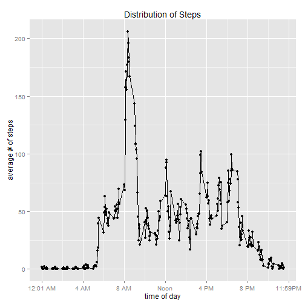

Reproducible Research, Peer Assignment #1
=========================================
---
date: "Due Sunday, February 15, 2015"
output: 
  html_document:
    keep_md: true
---


##Activity Monitoring Data Analysis, A Quick Look

###Synopsis
This report both describes the activity monitoring data collected by devices, as well as fulfills the Peer Assignment #1 course requirement.  Devices from companies such as Garmin, Samsung, Jawbone and others are entering mainstream market use.<sup>[1][1]</sup>  Large amounts of data are being collected and can be analysed more easily with available computing software and hardware.  Unfortunately, as described in the assignment, there is "...a lack of statistical methods and software for processing and interpreting the data."<sup>[2][2]</sup> 

The source of the data is identified as "a personal activity monitoring device."  For purposes of the assignment, we believe the data are intact and accurately reflect the output from such a monitoring device.  The data were collected at 5 minute intervals during the months of October and Novermber 2012.

###Loading and Preprocessing the Data
The data contains 3 columns in a comma-delimited file.  The file was included in a non-password protected zip file named "repdata-data-activity.zip." We read in the data using the standard read.csv command, converting NA to true missing and date to a true date.  

Basic description of the data follows:

```r
# Read in the data and create true date field
df <- read.csv("./data/activity.csv", na.strings="NA")
df$date.value <- as.Date(df$date, "%Y-%m-%d")

# Construct a day of week for later use
df$dow <- as.factor(weekdays(df$date.value))

# Examine the created dataset for documentation purposes
str(df)
```

```
## 'data.frame':	17568 obs. of  5 variables:
##  $ steps     : int  NA NA NA NA NA NA NA NA NA NA ...
##  $ date      : Factor w/ 61 levels "2012-10-01","2012-10-02",..: 1 1 1 1 1 1 1 1 1 1 ...
##  $ interval  : int  0 5 10 15 20 25 30 35 40 45 ...
##  $ date.value: Date, format: "2012-10-01" "2012-10-01" ...
##  $ dow       : Factor w/ 7 levels "Friday","Monday",..: 2 2 2 2 2 2 2 2 2 2 ...
```

```r
summary(df)
```

```
##      steps                date          interval        date.value        
##  Min.   :  0.00   2012-10-01:  288   Min.   :   0.0   Min.   :2012-10-01  
##  1st Qu.:  0.00   2012-10-02:  288   1st Qu.: 588.8   1st Qu.:2012-10-16  
##  Median :  0.00   2012-10-03:  288   Median :1177.5   Median :2012-10-31  
##  Mean   : 37.38   2012-10-04:  288   Mean   :1177.5   Mean   :2012-10-31  
##  3rd Qu.: 12.00   2012-10-05:  288   3rd Qu.:1766.2   3rd Qu.:2012-11-15  
##  Max.   :806.00   2012-10-06:  288   Max.   :2355.0   Max.   :2012-11-30  
##  NA's   :2304     (Other)   :15840                                        
##         dow      
##  Friday   :2592  
##  Monday   :2592  
##  Saturday :2304  
##  Sunday   :2304  
##  Thursday :2592  
##  Tuesday  :2592  
##  Wednesday:2592
```


```r
# Calculate the means, and missing counts
na.mean <- format(100*mean(is.na(df$steps)),digits=4)
na.count <- format(sum(is.na(df$steps)),big.mark=",")
all.count <- format(nrow(df),big.mark=",")
```
Missing values in steps account for 13.11% of the observations.


###Per Day Calculations
We calculated the mean and median steps per day, ignoring missing values, and produced the following histogram.


```r
# Calculate the sum of steps per date
attach(df)
perday <- aggregate(steps~date.value, FUN = sum, rm.NA=TRUE)
detach(df)

# Format the steps with commas
perday$steps.formatted <- format(perday$steps,big.mark=",")

# Prepare and display the Plot
t<-ggplot(perday, aes(x=steps)) + geom_histogram(fill="green",color="black",) 
t<- t + labs(title="Distribution of Total Steps Per Day (Without Imputation)", y="# of days", x ="steps taken") + scale_y_continuous(breaks=seq(c(0:10))) 
t <- t + scale_x_continuous(breaks=c(0,5000,10000,15000,20000,25000), labels=c("0","5,000","10,000","15000","20,000","25000"))

suppressMessages(print(t))
```

 

```r
# Calculate the mean and median with formats for display in-line
steps.mean   <- format(mean(perday$steps),big.mark=",")
steps.median <- format(median(perday$steps),big.mark=",")
```

The mean number of steps per day is 10,767.19 and the median is 10,766.


###Average Daily Activity Patterns

We calculated the mean number of steps per 5 minute interval and produced the following graphic.  


```r
# Calculate the average steps per interval
attach(df)
avgday <- aggregate(steps~interval, FUN = mean, rm.NA=TRUE)
detach(df)

#Prepare and display the plots
t1 <- ggplot(avgday, aes(interval, steps)) + geom_line() + geom_point()
t1 <- t1 + labs(title="Distribution of Steps", y="average # of steps", x ="time of day") + scale_x_continuous(breaks=c(0,400,800,1200,1600,2000,2400),labels=c("12:01 AM","4 AM","8 AM","Noon","4 PM","8 PM","11:59PM"))

suppressMessages(print(t1))
```

 

```r
# Calculate the maximum number of steps and find which interval it corresponds to for in-line display
m.steps  <- max(avgday$steps)
m.interval <- avgday[avgday$steps==m.steps,"interval"]
```

Starting in the morning we see an increase of activity, with the time period of 835 having the highest average number of steps(206.1698113).  Activity drops off during the evening.

###Computing Missing Values
As discussed in the assignment, missing values can sometimes lead to bias in calculations.  AS reported earlier, missing values account for 13.11% (2,304) of the possible 17,568 step observations.

We imputed missing steps using a transform function from Ken Kleinsman in "Example 2014.5: Simple mean imputation."<sup>[3][3]</sup>


```r
df.imputed  = transform(df, steps = ifelse(is.na(steps), mean(steps, na.rm=TRUE), steps))
```


```r
# Calculate the sum of steps per interval
attach(df.imputed)
perday.imputed <- aggregate(steps~date, FUN = sum, rm.NA=TRUE)
perday.imputed$steps.formatted <- format(perday.imputed$steps,big.mark=",")

# Prepare and Display the plots, including the original one.
t.imputed <-ggplot(perday.imputed, aes(x=steps)) + geom_histogram(fill="green",color="black",)
t.imputed <- t.imputed + labs(title="Distribution of Total Steps Per Day (With Imputation)", y="# of days", x ="steps taken") + scale_y_continuous(breaks=seq(c(0:10))) 
t.imputed <- t.imputed + scale_x_continuous(breaks=c(0,5000,10000,15000,20000,25000), labels=c("0","5,000","10,000","15000","20,000","25000"))

suppressMessages(print(t.imputed))
```

 

```r
suppressMessages(print(t))
```

 

```r
# Calculate the mean and median steps using the impute data for display in-line
steps.mean.imputed   <- format(mean(perday.imputed$steps),big.mark=",")
steps.median.imputed <- format(median(perday.imputed$steps),big.mark=",")
```

With imputation, The mean number of steps per day is 10,767.19 and the median is 10,767.19 compared to 10,767.19 and the median is 10,766 without imputation.  We see only a slight change in the median because of imputation, and the imputed histogram is consistent with the original histrogram.  The following quick distributions show the effect of the imputation.


```r
# Show the basic statistics of steps before/after imputation
summary(perday$steps)
```

```
##    Min. 1st Qu.  Median    Mean 3rd Qu.    Max. 
##      42    8842   10770   10770   13300   21200
```

```r
summary(perday.imputed$steps)
```

```
##    Min. 1st Qu.  Median    Mean 3rd Qu.    Max. 
##      42    9820   10770   10770   12810   21200
```

###Differences Between Weekdays and Weekends

In order to compare differences in activity between weekdays (Monday through Friday) and weekends (Saturday and Sunday), we constructed a factor using a slick piece of code from Yingua, Hu on nabble.com.<sup>[4][4]</sup>  This creates a factor variable for our new plots.

As can be seen from the following plots, activity on the weekdays begins earlier.  Overall, activity is also higher at each time of the weekday except for 8PM on the weekend.  This woudl suggestion that people are more active during the week, but both sleep later, and are less active on weekends, especially during sports season, when these data were collected.


```r
# Create a factor variable of Weekday vs. Weekend and display table to confirm validity.
df.imputed$period <- as.factor(ifelse(weekdays( df.imputed$date.value) %in% c("Saturday","Sunday"), "Weekend", "Weekday")) 

table(df.imputed$dow,df.imputed$period)
```

```
##            
##             Weekday Weekend
##   Friday       2592       0
##   Monday       2592       0
##   Saturday        0    2304
##   Sunday          0    2304
##   Thursday     2592       0
##   Tuesday      2592       0
##   Wednesday    2592       0
```


```r
# Calculate the sum and mean steps by interval, by period(Weekend/Weekday)
attach(df.imputed)
```

```
## The following objects are masked from df.imputed (pos = 3):
## 
##     date, date.value, dow, interval, steps
```

```r
df2a.imputed  <- aggregate(df.imputed$steps, list(interval,period), FUN=sum)
df2b.imputed  <- aggregate(df.imputed$steps, list(interval,period), FUN=mean)
colnames(df2a.imputed) <- c("interval","period","steps")
colnames(df2b.imputed) <- c("interval","period","steps")
detach(df.imputed)

# Prepare and display the Plot
t2 <- ggplot(df2b.imputed, aes(interval, steps)) + geom_line() + geom_point() # the color is not working
t2 <- t2 + labs(title="Distribution of Steps", y="# of steps", x ="time of day") + scale_x_continuous(breaks=c(0,400,800,1200,1600,2000,2400),labels=c("12:01 AM","4 AM","8 AM","Noon","4 PM","8 PM","11:59PM"))
t2 <- t2 + facet_grid(period~.) + theme(strip.background = element_rect(fill="pink"))

suppressMessages(print(t2))
```

 

###Libraries Loaded  

```r
# Document the libraries and environment for display in-line
libraries.loaded <- .packages()
require(utils)
sinfo <- sessionInfo()
pinfo <- .Platform
```

The following libraries are needed for reproducing the output: *dplyr, ggplot2, knitr, stats, graphics, grDevices, utils, datasets, methods, base*

This run was created with R version 3.1.2 (2014-10-31) on a windows x64 bit machine.


<!---
References
The following command is run manually to get the .md file for submission.
knit2html("PA1_template.rmd")
---> 
[1]: http://www.cnet.com/topics/wearable-tech/best-wearable-tech/  
[2]: https://class.coursera.org/repdata-011/human_grading/view/courses/973512/assessments/3/submissions   
[3]: http://www.r-bloggers.com/example-2014-5-simple-mean-imputation/
[4]: http://r.789695.n4.nabble.com/Summing-daily-values-by-weekday-and-weekend-td3685732.html
